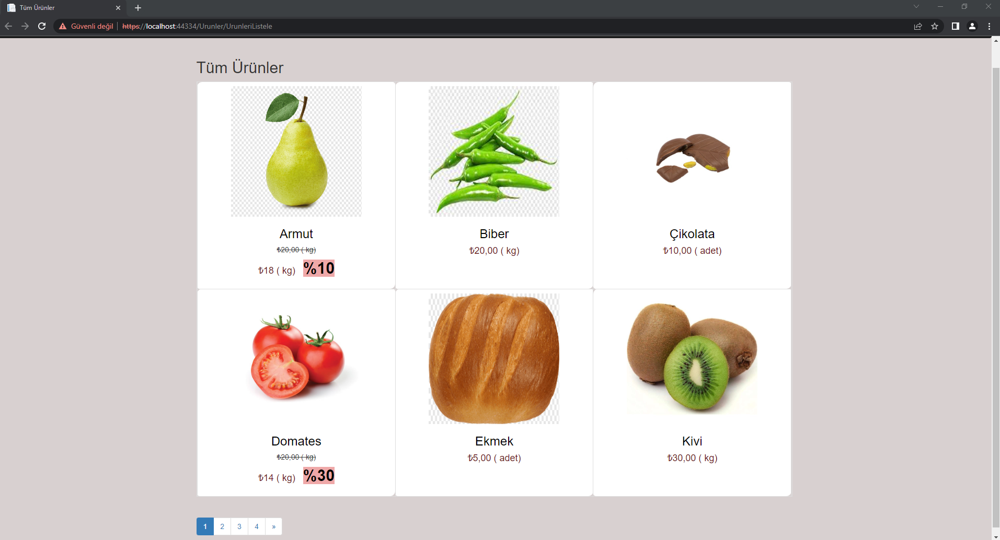
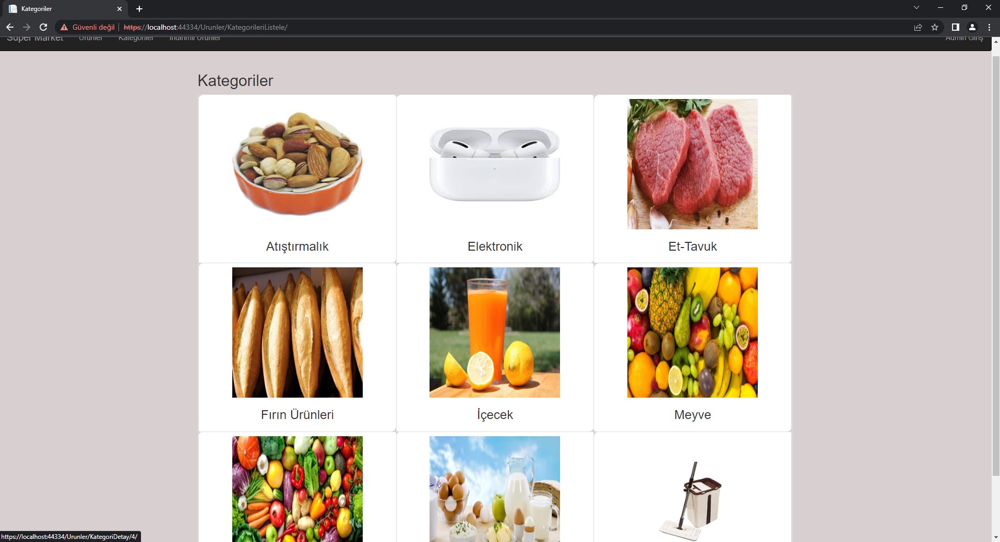
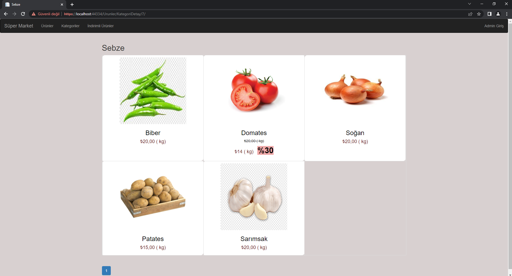
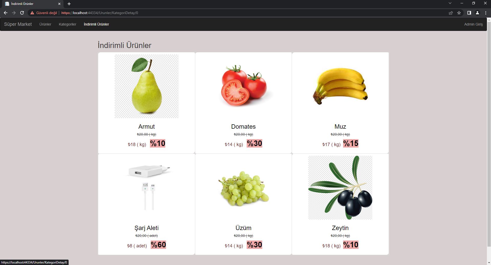
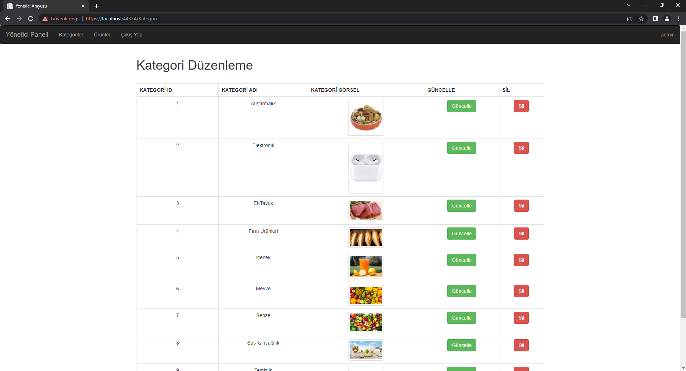
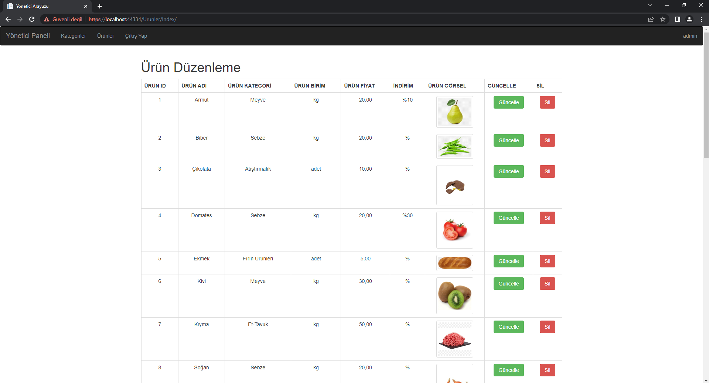
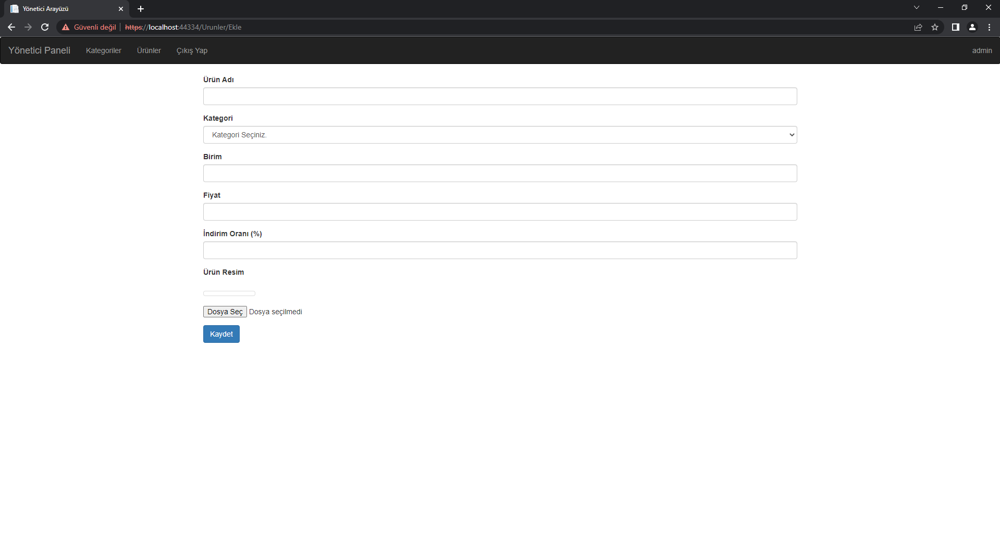
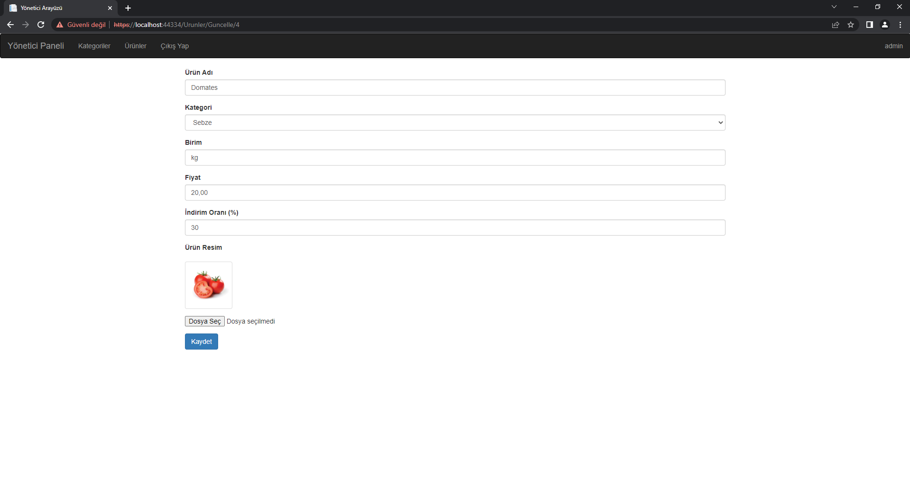
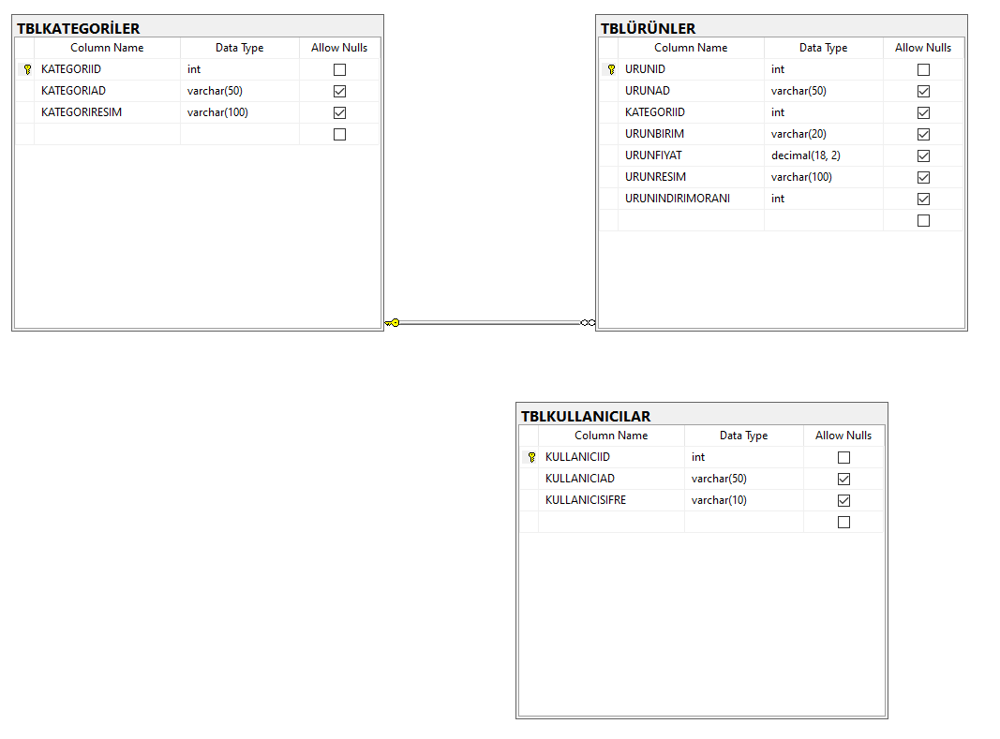

## ASP.NET MVC Projesi

### Misafir kullanıcılar tüm ürünleri, indirimli ürünleri veya kategoriye ait ürünleri listeleyebilmektedirler.
### Admin girişi yapan kullanıcı kategori ve ürünlerde ekleme,silme ve güncelleme yapabilmektedir.
#### Projede Entity Framework kullanılmıştır.
#### Sayfalama için PagedList kütüphanesi kullanılmıştır.

##### Tüm kullanıcıların görebildiği Tüm Ürünler sayfası.

##### Kategoriler sayfasında istenilen kategori seçilerek kategoriye ait ürünler listelenebilmektedir.

##### İndirimli Ürünler sayfası.

##### Admin girişi yapan kullanıcının kategorileri düzenleyebildiği sayfa.

##### Yeni Ürün Ekleme sayfası.

##### Ürün güncelleme sayfası.

##### Veritabanı tabloları.

